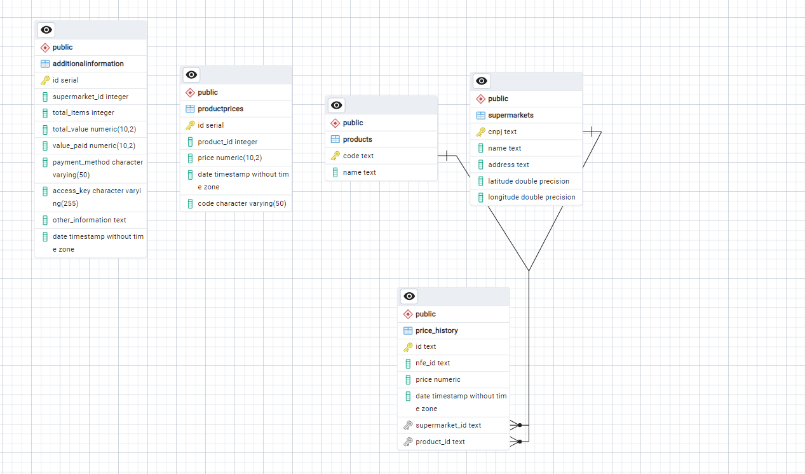

# SNS Publisher Lambda Function

Este projeto implementa uma função AWS Lambda que processa mensagens de uma fila SQS contendo informações de notas fiscais eletrônicas (NFe). A função armazena essas informações em um banco de dados PostgreSQL e utiliza a API de Geolocalização do Google para obter a latitude e longitude dos supermercados.

## Estrutura do Projeto

- **Adapters**: Implementações de gateways e repositórios para interação com APIs externas e banco de dados.
- **Entities**: Classes que representam entidades do domínio, como `Product`, `ProductPrice`, e `Supermarket`.
- **Registries**: Classe para gerenciar instâncias de gateways.
- **Use-cases**: Casos de uso que encapsulam a lógica de negócios principal.
- **app.ts**: Função principal Lambda que processa o evento SQS.

## Configuração do Ambiente

### Variáveis de Ambiente

As seguintes variáveis de ambiente são necessárias:

- `AWS_ACCESS_KEY_ID`: Chave de acesso AWS.
- `AWS_ACCESS_SECRET_KEY`: Chave secreta de acesso AWS.
- `AWS_TOPIC_ARN`: ARN do tópico SNS.
- `PORT`: Porta para o servidor Express (se aplicável).
- `GOOGLE_API_KEY`: Chave de API do Google para geolocalização.
- `DATABASE_URL`: URL de conexão do banco de dados PostgreSQL.

### Dependências

Instale as dependências do projeto usando o npm:

```sh
npm install
```

## Estrutura do Banco de Dados

Crie as tabelas no PostgreSQL usando as seguintes instruções SQL:

```sql
CREATE TABLE IF NOT EXISTS supermarkets (
  cnpj TEXT PRIMARY KEY,
  name TEXT NOT NULL,
  address TEXT NOT NULL,
  latitude DOUBLE PRECISION NOT NULL,
  longitude DOUBLE PRECISION NOT NULL
);

CREATE TABLE IF NOT EXISTS products (
  code TEXT PRIMARY KEY,
  name TEXT NOT NULL
);

CREATE TABLE IF NOT EXISTS price_history (
  id TEXT PRIMARY KEY,
  nfe_id TEXT NOT NULL,
  price DECIMAL NOT NULL,
  date TIMESTAMP NOT NULL,
  supermarket_id TEXT NOT NULL,
  product_id TEXT NOT NULL,
  CONSTRAINT fk_supermarket FOREIGN KEY (supermarket_id) REFERENCES supermarkets (cnpj) ON DELETE CASCADE,
  CONSTRAINT fk_product FOREIGN KEY (product_id) REFERENCES products (code) ON DELETE CASCADE
);
```

## Implementação

### 1. `GoogleGeolocationGateway`

Classe que implementa a interface `GeoLocationGateway` para obter geolocalização a partir de um endereço usando a API do Google.

### 2. `PgConnection`

Classe que implementa a interface `DbConnection` para interagir com o banco de dados PostgreSQL.

### 3. `PgProductPriceRepository`

Classe que implementa a interface `ProductPriceRepository` para gerenciar a persistência de preços de produtos.

### 4. `PgProductRepository`

Classe que implementa a interface `ProductRepository` para gerenciar a persistência de produtos.

### 5. `PgSupermarketRepository`

Classe que implementa a interface `SupermarketRepository` para gerenciar a persistência de supermercados.

### 6. `CreateProductPriceUseCase`

Caso de uso para criar um novo preço de produto.

### 7. `CreateProductUseCase`

Caso de uso para criar um novo produto.

### 8. `CreateSupermarketUseCase`

Caso de uso para criar um novo supermercado.

### 9. `lambdaHandler`

Função principal Lambda que processa eventos SQS, valida dados usando Zod, e executa os casos de uso apropriados.

## Esquema e relacionamentos do Banco de dados



### Testes

Os testes são escritos usando Jest. Para executar os testes, use:

```sh
npm test
```

## Executando Localmente

Para executar a função Lambda localmente, você pode usar o `serverless-offline` ou `aws-sam-cli`. Certifique-se de configurar corretamente as variáveis de ambiente e dependências.

## Publicação

Para publicar a função Lambda, use o AWS CLI ou uma ferramenta de implantação como Serverless Framework. Certifique-se de definir todas as variáveis de ambiente necessárias no AWS Lambda.

## Licença

Este projeto está licenciado sob a [MIT License](LICENSE).